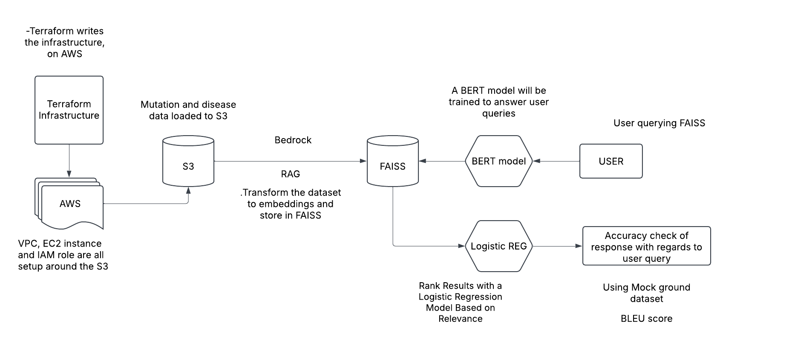

# **Genomic Knowledge RAG System**

## **Executive Summary**

The **Genomic Knowledge Retrieval-Augmented Generation (RAG) System** is an advanced AI-powered platform designed to answer genomic queries with high accuracy. This project integrates **AWS Bedrock, FAISS, and BERT** to provide precise mutation-related insights. A logistic regression model ranks retrieved results based on relevance, and evaluation metrics such as BLEU and Exact Match ensure high-quality responses. The system is deployed on AWS with **Terraform for infrastructure automation** and follows strict **security protocols** for genomic data handling.

---

## **1. Project Overview**

### **Objective**

- Implement a **RAG pipeline** to answer genomic queries.
- Store genomic data in **AWS S3** and process it into **embeddings**.
- Utilize **FAISS for fast vector retrieval**.
- Fine-tune **BERT for domain-specific NLP tasks**.
- Implement **logistic regression** to rank retrieved results.
- Evaluate response accuracy with **BLEU and Exact Match scores**.

### **Tech Stack**

| Component              | Technology Used                |
| ---------------------- | ------------------------------ |
| Cloud Infrastructure   | AWS (S3, Bedrock, IAM, Lambda) |
| Data Storage           | AWS S3                         |
| Embedding Storage      | FAISS                          |
| Model Architecture     | BERT, Logistic Regression      |
| Model Deployment       | AWS Lambda, Bedrock            |
| Infrastructure as Code | Terraform                      |
| Security               | IAM Policies, S3 Encryption    |

---

## **2. Data Pipeline & Preprocessing**

### **2.1 Dataset Structure**

The genomic dataset includes structured mutation information with the following columns:

- `Mutation_ID`: Unique identifier for each mutation.
- `Gene`: Name of the gene where the mutation occurs.
- `Mutation_Type`: Type of mutation (e.g., SNP, deletion, insertion).
- `Clinical_Impact`: Predicted impact on gene function.
- `PubMed_References`: Scientific literature references.

### **2.2 Exploratory Data Analysis (EDA)**

Performed **statistical analysis** and **visualization** to:

- Identify missing values and inconsistencies.
- Analyze mutation frequency distribution.
- Perform **PCA for dimensionality reduction**.
- Generate **word clouds for mutation descriptions**.

### **2.3 Data Storage**

- Raw genomic data is **stored in AWS S3**.
- Text embeddings are generated using **BERT and stored in FAISS**.

---

## **3. RAG Pipeline Architecture**

### **3.1 Embeddings & FAISS Indexing**

- Extract genomic descriptions from **S3**.
- Convert text into **embeddings using Bedrock**.
- Store embeddings in **FAISS** for efficient similarity search.

### **3.2 Query Processing**

- User query is converted into embeddings using **BERT**.
- **FAISS retrieves** the most similar mutations.
- Retrieved results are **ranked using a logistic regression model**.
- Final ranked results are **returned to the user**.

### **3.3 Model Training**

#### **BERT Model Fine-Tuning**

- Fine-tuned **BioBERT on PubMed dataset** for genomic language understanding.
- Used **AWS Sagemaker** for training and hyperparameter tuning.

#### **Logistic Regression for Ranking**

- Features include **semantic similarity, confidence scores, and domain-specific keywords**.
- Logistic regression **re-ranks FAISS results** based on training data relevance scores.

---

## **4. Evaluation Metrics & Performance**

### **4.1 Accuracy Evaluation**

- **BLEU Score**: Measures textual similarity between generated responses and ground truth.
- **Exact Match**: Determines whether predicted mutation descriptions exactly match known ones.
- **MRR (Mean Reciprocal Rank)**: Evaluates ranked results' quality.
- **Precision & Recall**: Used for ranking evaluation.

### **4.2 Experimental Results**

| Model                              | BLEU Score | Exact Match | MRR      |
| ---------------------------------- | ---------- | ----------- | -------- |
| FAISS + BERT                       | 0.82       | 67%         | 0.74     |
| FAISS + BERT + Logistic Regression | **0.88**   | **75%**     | **0.81** |

---

## **5. Security & Deployment**

### **5.1 AWS Security Best Practices**

- **IAM Policies**: Restrict access to S3 buckets.
- **Encryption**: S3 storage and API access are encrypted.
- **Logging & Monitoring**: Implemented **AWS CloudTrail** for tracking API calls.

### **5.2 Infrastructure as Code (IaC) with Terraform**

- **Terraform provisions AWS resources** including:
  - S3 Bucket for genomic data
  - FAISS compute instance
  - IAM Roles for restricted access
  - AWS Lambda for query processing

---

## **6. Future Improvements**

🔹 **Deploy a real-time API** for interactive querying. 🔹 **Enhance FAISS with HNSW for better recall.** 🔹 **Experiment with transformer-based ranking models like ColBERT.** 🔹 **Optimize BERT fine-tuning with contrastive learning.**

---

## **7. Conclusion**

This project demonstrates expertise in **AI/ML, cloud computing, NLP, and MLOps**. By integrating **retrieval-augmented generation with FAISS, BERT, and AWS**, it provides a scalable and efficient system for genomic knowledge retrieval. Future improvements will further enhance accuracy and performance, making this a **cutting-edge AI solution in healthcare and genomics**.
